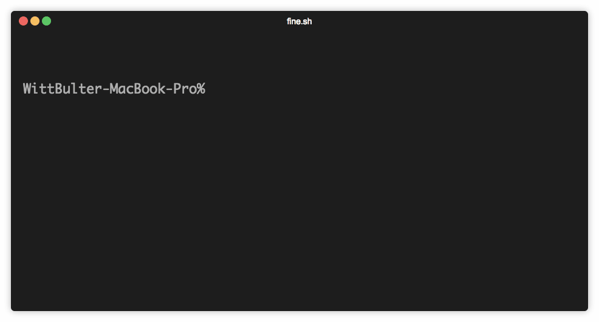

<p align="center" height="250">
  
</p>
<br/>
<br/>

> fine -- generate your document site in 3 seconds
  
&emsp;&emsp;Fine is currently in beta, and we will bring more updates on its functionality and integrity as the project develops.
  
&emsp;&emsp;You can leave comments and suggestions [here](https://github.com/just-fine/fine.sh-cli/issues/new).

&emsp;&emsp;[中文文档](README_CN.md)

<br/>

## Preview
[](https://app.fossa.io/projects/git%2Bgithub.com%2Fjust-fine%2Ffine.sh-cli?ref=badge_shield)


<p align="left" height="250">
  
</p>


## What is Fine

&emsp;&emsp;Fine is a tool to help you generate document sites from individual documents without a server required on your part. It is fast, safe and easy to use, plus you don’t have to worry about neither style nor implementation at all.

&emsp;&emsp;You can even use Fine to start your own blog, as it provides customized domains to each site it generates.

&emsp;&emsp;And of course, as a rule of thumb, Fine is always free.
   
&emsp;&emsp;[more](https://fine.sh)

<br/>

## Have a try

   ```
   npx @fine.sh/cli
   ```

<br/>

## THANKS

Translator:

  -  Szyanne

<br/>

## LICENSE


<a target="_blank" href="https://opensource.org/licenses/MIT" title="License: MIT"></a>

<br/>
<br/>


[](https://app.fossa.io/projects/git%2Bgithub.com%2Fjust-fine%2Ffine.sh-cli?ref=badge_large)